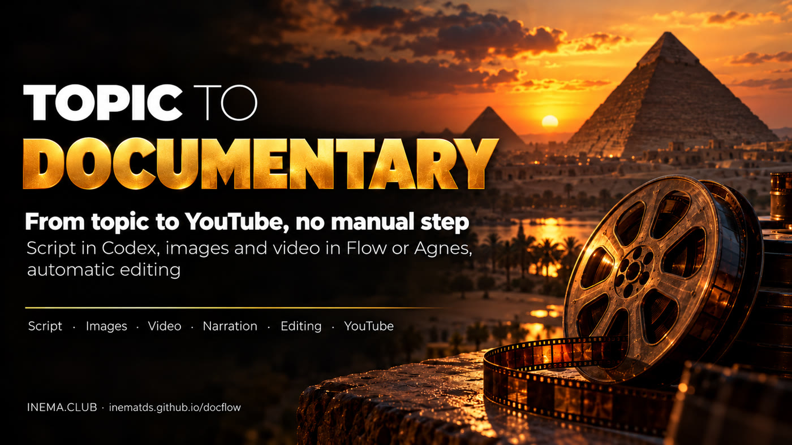

# docflow

[](https://inematds.github.io/docflow/guia/en/)

**🇧🇷 [Português](README.md) · 🇺🇸 [English](README.en.md) · 🇪🇸 [Español](README.es.md)**

**Topic → short narrated documentary → YouTube, with no manual steps.**

## What it is

docflow is a command-line tool that creates short narrated documentaries, the kind used on "dark" YouTube channels where nobody appears on screen. You answer 6 questions in a file (topic, style, duration, duration of each scene, format and references) and it does the rest: it writes the script, generates the images and videos for each scene, narrates, assembles everything with music and transitions, and publishes to YouTube. It automatically recreates a process that is normally done by hand in ChatGPT, Google Flow and CapCut. To use it, you need Linux with Python, ffmpeg and Codex.

## 📖 User guide

Full guide (landing + step by step): **https://inematds.github.io/docflow/guia/en/**

## Where it came from

docflow automates the "dark channel" process (faceless documentary) shown in a tutorial
video. In it, everything was done by hand:

1. a "flow" in ChatGPT asks 6 questions and returns the script, the text to narrate, image prompts and video prompts;
2. in **Google Flow**, the agent generates the images (Nano Banana) and then the videos (Omni Flash), scene by scene;
3. the narration comes from the **AI Studio** TTS;
4. the soundtrack comes from **Flow Music**;
5. assembly is done in **CapCut**: speed, transitions, fade from black, ambient sound at 15–18% and music low under the voice;
6. the video is uploaded to **YouTube**.

Here each step is one command, and the image and video engine can be swapped.

Version: **0.7.0**

---

## The plan: three paths

| Step | **A. Automated Flow** (Google account `inematds`) | **B. Codex + Agnes / Kie** (via API) | **C. Local** (no API) |
|---|---|---|---|
| Questions, script and prompts (the "GPT flow") | Codex, via subscription | Codex, via subscription | Codex, via subscription |
| Images | Flow agent (Nano Banana) | Agnes `agnes-image-2.1-flash` (US$ 0) or Nano Banana via Kie | flux2-klein |
| Video per scene | Flow agent (Omni/Veo) | Agnes `agnes-video-v2.0`, image→video, or Veo/Kling via Kie | local LTX or image with motion (pixflow) |
| Voice | AI Studio TTS through the browser | Gemini TTS (API) or inemavox | inemavox |
| Music | Flow Music through the browser | inemavox library/dlp | inemavox library/dlp |
| Assembly (the CapCut part) | automatic ffmpeg | automatic ffmpeg | automatic ffmpeg |
| Publishing | `yt-pubx` | `yt-pubx` | `yt-pubx` |
| Cost | Google plan credits | Agnes US$ 0; Kie charges per generation | zero |
| Fragility | high: the screen changes | low | low |

### Status of each engine

| Engine | Status | Note |
|---|---|---|
| `agnes` (B) | ✅ **tested**: the sample video came out of it | Agnes API authorized by Nei on 07/10/2026 |
| `reais` | ✅ **tested**: El Niño 2026 with maps, satellite, photos and charts | no image AI; only reusable-licence images |
| `flow` (A) | ⏳ **written, not validated** | the `inematds` account login is missing in the robot profile; the first real use calibrates the buttons |
| `kie` (B) | ❌ not implemented | paid API: only with explicit authorization |
| `local` (C) | ❌ not implemented | fallback: flux2-klein + pixflow |

Narration, music and assembly are the same across all engines. Today the voice is inemavox
(chatterbox, voice `nei`, one line per scene) and the music comes from the inemavox library.

---

## How Flow becomes automatic

In the video, the author pasted 2 blocks of prompts and clicked many buttons. The Flow agent already
accepts a whole block and generates everything numbered, so the robot (`motores/flow.mjs`, Playwright)
just repeats the clicks:

1. opens `labs.google/flow` in a Chromium with its own profile, already logged in (`~/.config/docflow/chrome-flow`), on the virtual display `:99`;
2. new project → 16:9 format → turns on the agent;
3. pastes `bloco-imagens.txt` (numbered prompts `001…N`) and sends it;
4. clicks "always approve"/"approve" whenever the agent asks;
5. waits for N images to appear. If any is missing, the screenshot shows which one;
6. pastes `bloco-videos.txt` and approves again;
7. asks the agent to "create a collection with everything" and **downloads the collection as a zip** (the shortcut from the video to avoid downloading one by one);
8. unzips and distributes into `imagens/NNN.png` and `videos/NNN.mp4` by file number;
9. from there on (narration, assembly, publishing) it is the same as the other engines.

Each step saves a screenshot to `tmp/flow-*.png`, to calibrate when the Flow screen changes.

The robot uses **Playwright** and not the Claude in Chrome extension: you don't need to open
Claude with `claude --chrome`. It opens a **second Chromium** on display `:99`, next to
the `stack99` Chromium (HeyGen/Magnific). Rule of `:99`: one automation at a time. Do not
run HeyGen or Magnific through the browser while a `--motor flow` is running.

We do not use Flow's internal endpoints without the screen: they are not public, they break without warning and
put the account at risk.

**First use (once, done by Nei):**

```bash
systemctl --user status stack99      # display :99 up
./docflow flow-login                 # opens Chromium on :99
# open VNC at localhost:5900, sign in with inematds@gmail.com and accept the Flow terms
./docflow gerar temas/egito.yaml --motor flow
```

Steps from the video that are still outside Flow: AI Studio TTS and Flow Music. They will come in as
voice and music engines in the next version, through the same robot.

---

## Usage

```bash
./docflow tudo temas/egito.yaml          # script → generate → narrate → assemble
./docflow publicar temas/egito.yaml      # yt-pubx in dry-run: title, description, tags, thumb
./docflow publicar temas/egito.yaml --enviar   # actually uploads (after checking)
./docflow descricao temas/egito.yaml --video <URL>   # reapplies the description to an already published video
```

The YouTube description comes with an automatic footer: the project (repo link), the tools and
APIs used at each step (depending on the engine), the music credit and the promotion of
**INEMA.CLUB**, a free education platform.

Each step also runs on its own (`roteiro`, `gerar`, `narrar`, `montar`). All of them can be
repeated: they redo only what is missing. `roteiro --refazer` asks Codex for a new script.

**A scene that "drifted"** (the video generator changed the era, the architecture or the face):
`./docflow estatica temas/egito.yaml --cenas 6` replaces the AI clip with the image itself
with a slow zoom, without video AI, and then you just run `montar` again. It is the feature of the
"images only" channels mentioned in the reference video. The discarded clip goes to `tmp/descartes/`.
To redo an AI clip, delete `videos/NNN.mp4` and run `gerar`: only that one is redone.

### Styles: which video you can ask for

`./docflow estilos` lists the ready-made styles; in the theme, `estilo: <name>` turns on each one's defaults.

| Style | What it is | Example |
|---|---|---|
| `documentario` | AI-generated scenes (image → video), calm narration | [Egypt](https://www.youtube.com/watch?v=TsVY4UUc5gI) |
| `reais` | real maps, satellite and photos, animated charts, numbers on screen | [El Niño in numbers](https://www.youtube.com/watch?v=IE_D18omUjE) |
| `alerta-vertical` | 9:16 Short: ALERT on top, image above, live map below, word-by-word captions (hand-built prototype) | [El Niño ALERT](https://www.youtube.com/watch?v=6OzZWiQHHdw) |
| `historia` | explainer in the style of science-communication channels: viral opening (frame 0 = impact art with the hook line, also used as the thumbnail, and 1.5–2.4 s cuts in the first ~20 s), promise, analogy, **on-screen proof** (official page screenshot with the passage highlighted), animated graphics, earth.nullschool live maps and Agnes cinematic b-roll; a cut every 4–5 s | El Niño pilot (3 min) |
| `historia-apresentador` | the same, with Nei's avatar (HeyGen, paid) in some blocks | El Niño pilot |

In the `historia` style the script template (`roteiro/flow-historia.md`) returns, per block, the narration and the list of visuals. `gerar` makes the b-roll and narration; `montar` records the live maps, takes the screenshots and draws the graphics. Avatar: `./docflow apresentador themes/x.yaml --look computador --teste` renders only the first block and prints the real cost.

### Real images + dynamic pace mode (current topics, with data)

For news, science or any topic that calls for **real images** (maps, satellite, photos) and
**numbers**, set in the theme: `motor: reais`, `ritmo: dinamico` (cuts every 2–3 s; `calmo` =
1–2 shots per scene), `imagens_reais:` (a folder with `creditos.json`), `fatos:` (the dated
numbers the narration may use) and `graficos:` (series that become animated line or bar charts).

- `creditos.json`: list of images with `arquivo`, `descricao`, `data`, `credito` (the line shown
  on screen), `licenca` and `fonte_url`. Only reusable licences (NOAA, NASA, INPE, Copernicus,
  Wikimedia CC…). Archive photos are labelled "Foto de arquivo (year)".
- The script (Codex) picks catalogue images for each part of the narration and shows the number
  on screen when the narration cites it. Every shot moves (zoom or pan), with credit and a
  place/date label.
- `gerar` narrates first and cuts each scene to the exact length of its speech. The YouTube
  description lists the credits of the images used.
- `refazer_ia: fotos` (or a list of files): Agnes remakes each photo using the original as reference (image → image), for photos without a reuse licence. Maps, satellite and charts stay real (AI would invent data). On screen the credit becomes "Ilustração IA (Agnes) · inspirada em foto de …".
- Example: `temas/elnino-2026-reais.yaml` (data from 2026-10-07).

### The theme (the 6 questions of the flow)

```yaml
slug: egito-antigo
tema: "Ancient Egypt in one minute ..."
estilo: "realistic cinematic documentary, natural golden light, 35mm film look"
duracao_total: 60      # 3. total duration (s)
duracao_cena: 10       # 4. duration of each scene (s) → 6 scenes
formato: "16:9"        # 5. format
idioma: "português do Brasil"
referencias: "nenhuma" # 6. references
motor: agnes           # flow | agnes | reais
voz: nei
musica: ~/projetos/inemavox/jobs/audio_library/music/<faixa>.mp3
canal: lives10         # yt-pubx channel
```

### What comes out in `~/projetos/output/docflow/<slug>/`

| File | What it is |
|---|---|
| `plano.json` | script, prompts, voice direction, music prompt, title/description/tags |
| `bloco-imagens.txt`, `bloco-videos.txt` | the blocks to paste into the Flow agent (they also work by hand) |
| `narracao.txt`, `musica.txt` | clean text to narrate and prompt to generate the soundtrack (Flow Music, Suno...) |
| `imagens/NNN.png`, `videos/NNN.mp4`, `narracao/NNN.wav` | material numbered by scene |
| `final.mp4` | the assembled documentary |

### The assembly (what CapCut used to do)

- Each clip is sped up or slowed down (up to ±25%) to fit its line. Whatever is left over is cut or freezes on the last frame.
- Between scenes, a smooth 0.7 s transition.
- Fade from black at the start and to black at the end.
- Ambient sound from the clips at 16%.
- Music at 30%, which ducks automatically when the voice speaks (sidechain), with fade in and fade out.
- At the end, a CTA scene: INEMA.CLUB over the blurred last image, with the voice inviting viewers to the site (`cta: false` in the theme turns it off).

## Sample video

**"Ancient Egypt in one minute: from the Nile to Cleopatra"**: 6 scenes, 55 s, 16:9, Agnes engine,
voice `nei`. It is at `~/projetos/output/docflow/egito-antigo/final.mp4`.

What was measured in this first round:

| Step | Time | Note |
|---|---|---|
| script (Codex) | 48 s | 6 scenes of 16 to 19 words, dates written out in full |
| 6 images + 6 clips (Agnes) | ~5 min | 1 error 429 (limit of 6/min), recovered on its own |
| 6 narrations (inemavox) | 2.5 min | checked by local transcription: text matches the script |
| assembly (ffmpeg) | 18 s | −17.9 LUFS |
| publish | 84 s | published at https://www.youtube.com/watch?v=TsVY4UUc5gI (INEMA Agentes channel), pyramids thumb (`thumb_cena: 3`) |

Scene 6 (port of Alexandria) drifted in both Agnes attempts: it turned into a
baroque port with a dome and caravels. It was left with `estatica` (image with slow zoom).

## Requirements

`python3` + `pyyaml`, `ffmpeg`, `codex` (subscription), `node` + global Playwright (flow engine),
inemavox up (`:8010`), `~/projetos/videos-agnes` (Agnes client) and `~/projetos/yt-pubx`.
