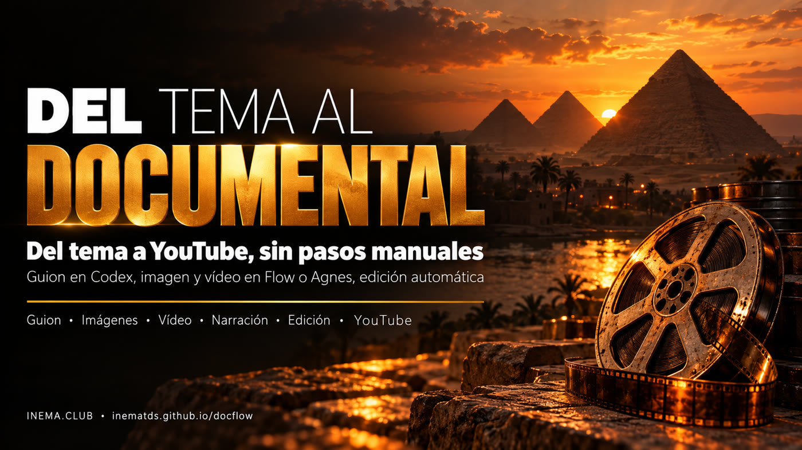

# docflow

[](https://inematds.github.io/docflow/guia/es/)

**🇧🇷 [Português](README.md) · 🇺🇸 [English](README.en.md) · 🇪🇸 [Español](README.es.md)**

**Tema → documental corto narrado → YouTube, sin pasos manuales.**

## Qué es

docflow es una herramienta de línea de comandos que crea documentales cortos narrados, del tipo que se usa en los canales "dark" de YouTube, donde no aparece nadie en pantalla. Respondes 6 preguntas en un archivo (tema, estilo, duración, duración de cada escena, formato y referencias) y él hace el resto: escribe el guion, genera las imágenes y los videos de cada escena, narra, monta todo con música y transiciones y lo publica en YouTube. Recrea de forma automática un proceso que normalmente se hace a mano en ChatGPT, Google Flow y CapCut. Para usarlo, necesitas Linux con Python, ffmpeg y Codex.

## 📖 Guía de uso

Guía completa (landing + paso a paso): **https://inematds.github.io/docflow/guia/es/**

## De dónde viene

docflow automatiza el proceso de "canal dark" (documental sin rostro) que se muestra en un video
tutorial. En él, todo se hacía a mano:

1. un "flow" en ChatGPT hace 6 preguntas y devuelve el guion, el texto para narrar, prompts de imagen y prompts de video;
2. en **Google Flow**, el agente genera las imágenes (Nano Banana) y después los videos (Omni Flash), escena por escena;
3. la narración sale del TTS de **AI Studio**;
4. la banda sonora sale de **Flow Music**;
5. el montaje se hace en **CapCut**: velocidad, transiciones, fundido desde negro, sonido ambiente al 15–18% y música baja bajo la voz;
6. el video se sube a **YouTube**.

Aquí cada etapa es un comando, y el motor de imagen y video se puede cambiar.

Versión: **0.6.0**

---

## El plan: tres caminos

| Etapa | **A. Flow automatizado** (cuenta Google `inematds`) | **B. Codex + Agnes / Kie** (por API) | **C. Local** (sin API) |
|---|---|---|---|
| Preguntas, guion y prompts (el "GPT flow") | Codex, con la suscripción | Codex, con la suscripción | Codex, con la suscripción |
| Imágenes | Agente de Flow (Nano Banana) | Agnes `agnes-image-2.1-flash` (US$ 0) o Nano Banana vía Kie | flux2-klein |
| Video por escena | Agente de Flow (Omni/Veo) | Agnes `agnes-video-v2.0`, imagen→video, o Veo/Kling vía Kie | LTX local o imagen con movimiento (pixflow) |
| Voz | AI Studio TTS desde el navegador | Gemini TTS (API) o inemavox | inemavox |
| Música | Flow Music desde el navegador | biblioteca/dlp de inemavox | biblioteca/dlp de inemavox |
| Montaje (el lugar de CapCut) | ffmpeg automático | ffmpeg automático | ffmpeg automático |
| Publicación | `yt-pubx` | `yt-pubx` | `yt-pubx` |
| Costo | créditos del plan de Google | Agnes US$ 0; Kie cobra por generación | cero |
| Fragilidad | alta: la pantalla cambia | baja | baja |

### Estado de cada motor

| Motor | Estado | Observación |
|---|---|---|
| `agnes` (B) | ✅ **probado**: el video modelo salió de él | API de Agnes autorizada por Nei el 07/10/2026 |
| `reais` | ✅ **probado**: El Niño 2026 con mapas, satélite, fotos y gráficos | sin IA de imagen; solo imágenes con licencia de reutilización |
| `flow` (A) | ⏳ **escrito, no validado** | falta el inicio de sesión de la cuenta `inematds` en el perfil del robot; el primer uso real calibra los botones |
| `kie` (B) | ❌ no implementado | API de pago: solo con autorización explícita |
| `local` (C) | ❌ no implementado | respaldo: flux2-klein + pixflow |

La narración, la música y el montaje son los mismos en todos los motores. Hoy la voz es inemavox
(chatterbox, voz `nei`, una línea por escena) y la música viene de la biblioteca de inemavox.

---

## Cómo Flow se vuelve automático

En el video, el autor pegaba 2 bloques de prompts y hacía clic en varios botones. El agente de Flow ya
acepta un bloque completo y genera todo numerado, así que el robot (`motores/flow.mjs`, Playwright)
solo repite los clics:

1. abre `labs.google/flow` en un Chromium con perfil propio, ya con sesión iniciada (`~/.config/docflow/chrome-flow`), en la pantalla virtual `:99`;
2. nuevo proyecto → formato 16:9 → activa el agente;
3. pega el `bloco-imagens.txt` (prompts numerados `001…N`) y lo envía;
4. hace clic en "aprobar siempre"/"aprobar" cada vez que el agente lo pide;
5. espera a que aparezcan N imágenes. Si falta alguna, la captura muestra cuál;
6. pega el `bloco-videos.txt` y vuelve a aprobar;
7. le pide al agente "crea una colección con todo" y **descarga la colección en zip** (el atajo del video para no descargar uno por uno);
8. descomprime y distribuye en `imagens/NNN.png` y `videos/NNN.mp4` según el número del archivo;
9. desde ahí (narración, montaje, publicación) es igual que en los otros motores.

Cada paso guarda una captura en `tmp/flow-*.png`, para calibrar cuando cambie la pantalla de Flow.

El robot usa **Playwright** y no la extensión Claude in Chrome: no hace falta abrir
Claude con `claude --chrome`. Abre un **segundo Chromium** en la pantalla `:99`, junto al
Chromium de `stack99` (HeyGen/Magnific). Regla del `:99`: una automatización a la vez. No
ejecutes HeyGen ni Magnific desde el navegador mientras un `--motor flow` esté corriendo.

No usamos los endpoints internos de Flow sin la pantalla: no son públicos, se rompen sin aviso y
ponen en riesgo la cuenta.

**Primer uso (una vez, lo hace Nei):**

```bash
systemctl --user status stack99      # pantalla :99 activa
./docflow flow-login                 # abre el Chromium en :99
# abrir el VNC en localhost:5900, entrar con inematds@gmail.com y aceptar los términos de Flow
./docflow gerar temas/egito.yaml --motor flow
```

Etapas del video que siguen fuera de Flow: AI Studio TTS y Flow Music. Entrarán como
motores de voz y música en la próxima versión, por el mismo robot.

---

## Uso

```bash
./docflow tudo temas/egito.yaml          # guion → generar → narrar → montar
./docflow publicar temas/egito.yaml      # yt-pubx en dry-run: título, descripción, tags, thumb
./docflow publicar temas/egito.yaml --enviar   # sube de verdad (después de revisar)
./docflow descricao temas/egito.yaml --video <URL>   # reaplica la descripción en un video ya publicado
```

La descripción de YouTube sale con un pie de página automático: el proyecto (enlace del repo), las herramientas y
APIs usadas en cada etapa (según el motor), el crédito de la música y la difusión de
**INEMA.CLUB**, plataforma de educación gratuita.

Cada etapa también se ejecuta por separado (`roteiro`, `gerar`, `narrar`, `montar`). Todas se pueden
repetir: rehacen solo lo que falta. `roteiro --refazer` le pide un guion nuevo a Codex.

**Escena que "se desvió"** (el generador de video cambió la época, la arquitectura o el rostro):
`./docflow estatica temas/egito.yaml --cenas 6` cambia el clip de IA por la propia imagen
con un zoom lento, sin IA de video, y después basta con volver a ejecutar `montar`. Es el recurso de los canales
"solo de imágenes" mencionado en el video de referencia. El clip descartado va a `tmp/descartes/`.
Para rehacer un clip de IA, borra `videos/NNN.mp4` y ejecuta `gerar`: solo se rehace ese.

### Estilos: qué video se puede pedir

`./docflow estilos` lista los estilos listos; en el tema, `estilo: <nombre>` activa los valores de cada uno.

| Estilo | Qué es | Ejemplo |
|---|---|---|
| `documentario` | escenas generadas por IA (imagen → video), narración tranquila | [Egipto](https://www.youtube.com/watch?v=TsVY4UUc5gI) |
| `reais` | mapas, satélite y fotos reales, gráficos animados, números en pantalla | [El Niño en números](https://www.youtube.com/watch?v=IE_D18omUjE) |
| `alerta-vertical` | Short 9:16: ALERTA arriba, imagen arriba, mapa en vivo abajo, subtítulo palabra por palabra (prototipo hecho a mano) | [El Niño ALERTA](https://www.youtube.com/watch?v=6OzZWiQHHdw) |
| `historia` | explicativo al estilo de los canales de divulgación: gancho de escena con paradoja, promesa, analogía, **prueba en pantalla** (captura de página oficial con el fragmento resaltado), gráficos animados, mapas en vivo de earth.nullschool y escenas de cine de Agnes; un corte cada 4–5 s | piloto El Niño (3 min) |
| `historia-apresentador` | lo mismo, con el avatar de Nei (HeyGen, de pago) en algunos bloques | piloto El Niño |

En el estilo `historia` la plantilla de guion (`roteiro/flow-historia.md`) devuelve, por bloque, la narración y la lista de visuales. `gerar` hace el b-roll y la narración; `montar` graba los mapas en vivo, toma las capturas y dibuja los gráficos. Avatar: `./docflow apresentador temas/x.yaml --look computador --teste` genera solo el primer bloque y muestra el costo real.

### Modo imágenes reales + ritmo dinámico (temas actuales, con datos)

Para noticias, ciencia o cualquier tema que pida **imagen real** (mapa, satélite, foto) y
**números**, ponga en el tema: `motor: reais`, `ritmo: dinamico` (cortes cada 2–3 s; `calmo` =
1–2 planos por escena), `imagens_reais:` (carpeta con `creditos.json`), `fatos:` (los números
fechados que la narración puede usar) y `graficos:` (series que se vuelven gráficos animados de
línea o barras).

- `creditos.json`: lista de imágenes con `arquivo`, `descricao`, `data`, `credito` (la línea que
  aparece en pantalla), `licenca` y `fonte_url`. Solo licencias de reutilización (NOAA, NASA,
  INPE, Copernicus, Wikimedia CC…). Las fotos de archivo llevan "Foto de arquivo (año)".
- El guion (Codex) elige las imágenes del catálogo para cada parte de la narración y muestra el
  número en pantalla cuando la narración lo cita. Cada plano tiene movimiento (zoom o paneo),
  crédito y la etiqueta de lugar y fecha.
- `gerar` narra primero y corta cada escena al tiempo exacto de su voz. La descripción de YouTube
  incluye los créditos de las imágenes usadas.
- `refazer_ia: fotos` (o lista de archivos): Agnes rehace cada foto usando la original como referencia (imagen → imagen), para fotos sin licencia de reutilización. Mapas, satélite y gráficos siguen reales (la IA inventaría datos). En pantalla el crédito pasa a "Ilustração IA (Agnes) · inspirada em foto de …".
- Ejemplo: `temas/elnino-2026-reais.yaml` (datos del 07/10/2026).

### El tema (las 6 preguntas del flow)

```yaml
slug: egito-antigo
tema: "El Antiguo Egipto en un minuto ..."
estilo: "realistic cinematic documentary, natural golden light, 35mm film look"
duracao_total: 60      # 3. duración total (s)
duracao_cena: 10       # 4. duración de cada escena (s) → 6 escenas
formato: "16:9"        # 5. formato
idioma: "português do Brasil"
referencias: "nenhuma" # 6. referencias
motor: agnes           # flow | agnes | reais
voz: nei
musica: ~/projetos/inemavox/jobs/audio_library/music/<faixa>.mp3
canal: lives10         # canal de yt-pubx
```

### Lo que sale en `~/projetos/output/docflow/<slug>/`

| Archivo | Qué es |
|---|---|
| `plano.json` | guion, prompts, dirección de voz, prompt de la música, título/descripción/tags |
| `bloco-imagens.txt`, `bloco-videos.txt` | los bloques para pegar en el agente de Flow (sirven también a mano) |
| `narracao.txt`, `musica.txt` | texto limpio para narrar y prompt para generar la banda sonora (Flow Music, Suno...) |
| `imagens/NNN.png`, `videos/NNN.mp4`, `narracao/NNN.wav` | material numerado por escena |
| `final.mp4` | el documental montado |

### El montaje (lo que hacía CapCut)

- Cada clip se acelera o se ralentiza (hasta ±25%) para encajar en su línea. Lo que sobra se corta o se congela en el último cuadro.
- Entre las escenas, una transición suave de 0,7 s.
- Fundido desde negro al inicio y hacia negro al final.
- Sonido ambiente de los clips al 16%.
- Música al 30%, que baja sola cuando habla la voz (sidechain), con fade in y fade out.
- Al final, una escena de CTA: INEMA.CLUB sobre la última imagen desenfocada, con la voz invitando al sitio (`cta: false` en el tema la desactiva).

## Video modelo

**"El Antiguo Egipto en un minuto: del Nilo a Cleopatra"**: 6 escenas, 55 s, 16:9, motor Agnes,
voz `nei`. Está en `~/projetos/output/docflow/egito-antigo/final.mp4`.

Lo que se midió en esta primera ronda:

| Etapa | Tiempo | Observación |
|---|---|---|
| guion (Codex) | 48 s | 6 escenas de 16 a 19 palabras, fechas escritas con todas sus palabras |
| 6 imágenes + 6 clips (Agnes) | ~5 min | 1 error 429 (límite de 6/min), se recuperó solo |
| 6 narraciones (inemavox) | 2,5 min | verificadas con transcripción local: el texto coincide con el guion |
| montaje (ffmpeg) | 18 s | −17,9 LUFS |
| publicar | 84 s | publicado en https://www.youtube.com/watch?v=TsVY4UUc5gI (canal INEMA Agentes), thumb de las pirámides (`thumb_cena: 3`) |

La escena 6 (puerto de Alejandría) se desvió en los dos intentos de Agnes: se convirtió en un
puerto barroco con cúpula y carabelas. Se quedó con `estatica` (imagen con zoom lento).

## Requisitos

`python3` + `pyyaml`, `ffmpeg`, `codex` (suscripción), `node` + Playwright global (motor flow),
inemavox activo (`:8010`), `~/projetos/videos-agnes` (cliente de Agnes) y `~/projetos/yt-pubx`.
