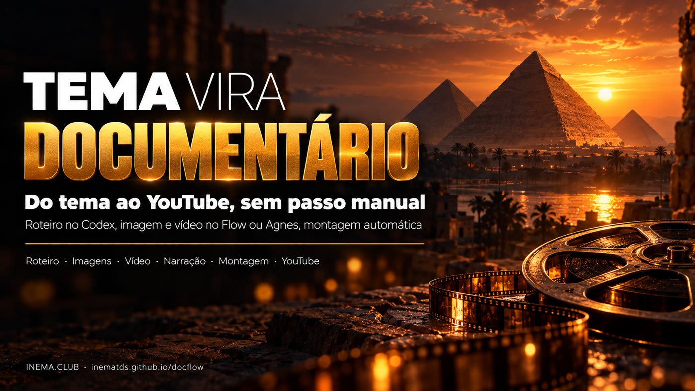

# docflow

[](https://inematds.github.io/docflow/guia/)

**🇧🇷 [Português](README.md) · 🇺🇸 [English](README.en.md) · 🇪🇸 [Español](README.es.md)**

**Tema → documentário curto narrado → YouTube, sem passo manual.**

## O que é

O docflow é uma ferramenta de linha de comando que cria documentários curtos narrados, do tipo usado em canais "dark" do YouTube, em que não aparece ninguém. Você responde 6 perguntas num arquivo (tema, estilo, duração, duração de cada cena, formato e referências) e ele faz o resto: escreve o roteiro, gera as imagens e os vídeos de cada cena, narra, monta com música e transições e publica no YouTube. Ele recria, de forma automática, um processo que normalmente se faz à mão no ChatGPT, no Google Flow e no CapCut. Para usar, você precisa de Linux com Python, ffmpeg e o Codex.

## 📖 Guia de uso

Guia completo (landing + passo a passo): **https://inematds.github.io/docflow/guia/**

## De onde veio

O docflow automatiza o processo de "canal dark" (documentário sem rosto) mostrado num vídeo
tutorial. Nele, tudo era feito à mão:

1. um "flow" no ChatGPT faz 6 perguntas e devolve roteiro, texto para narrar, prompts de imagem e prompts de vídeo;
2. no **Google Flow**, o agente gera as imagens (Nano Banana) e depois os vídeos (Omni Flash), cena por cena;
3. a narração sai do TTS do **AI Studio**;
4. a trilha sai do **Flow Music**;
5. a montagem é no **CapCut**: velocidade, transições, fade do preto, som ambiente a 15–18% e música baixa sob a voz;
6. o vídeo sobe no **YouTube**.

Aqui cada etapa é um comando, e o motor de imagem e vídeo pode ser trocado.

Versão: **0.5.0**

---

## O plano: três caminhos

| Etapa | **A. Flow automatizado** (conta Google `inematds`) | **B. Codex + Agnes / Kie** (por API) | **C. Local** (sem API) |
|---|---|---|---|
| Perguntas, roteiro e prompts (o "GPT flow") | Codex, pela assinatura | Codex, pela assinatura | Codex, pela assinatura |
| Imagens | Agente do Flow (Nano Banana) | Agnes `agnes-image-2.1-flash` (US$ 0) ou Nano Banana via Kie | flux2-klein |
| Vídeo por cena | Agente do Flow (Omni/Veo) | Agnes `agnes-video-v2.0`, imagem→vídeo, ou Veo/Kling via Kie | LTX local ou imagem com movimento (pixflow) |
| Voz | AI Studio TTS pelo navegador | Gemini TTS (API) ou inemavox | inemavox |
| Música | Flow Music pelo navegador | biblioteca/dlp do inemavox | biblioteca/dlp do inemavox |
| Montagem (o lugar do CapCut) | ffmpeg automático | ffmpeg automático | ffmpeg automático |
| Publicação | `yt-pubx` | `yt-pubx` | `yt-pubx` |
| Custo | créditos do plano Google | Agnes US$ 0; Kie cobra por geração | zero |
| Fragilidade | alta: a tela muda | baixa | baixa |

### Estado de cada motor

| Motor | Estado | Observação |
|---|---|---|
| `agnes` (B) | ✅ **testado**: o vídeo modelo saiu dele | API Agnes autorizada pelo Nei em 07/10/2026 |
| `reais` | ✅ **testado**: El Niño 2026 com mapas, satélite, fotos e gráficos | sem IA de imagem; só imagens com licença de reúso |
| `flow` (A) | ⏳ **escrito, não validado** | falta o login da conta `inematds` no perfil do robô; o 1º uso real calibra os botões |
| `kie` (B) | ❌ não implementado | API paga: só com autorização explícita |
| `local` (C) | ❌ não implementado | reserva: flux2-klein + pixflow |

Narração, música e montagem são as mesmas em todos os motores. Hoje a voz é o inemavox
(chatterbox, voz `nei`, uma fala por cena) e a música vem da biblioteca do inemavox.

---

## Como o Flow vira automático

No vídeo, o autor colava 2 blocos de prompts e clicava em vários botões. O agente do Flow já
aceita um bloco inteiro e gera tudo numerado, então o robô (`motores/flow.mjs`, Playwright)
só repete os cliques:

1. abre `labs.google/flow` num Chromium com perfil próprio, já logado (`~/.config/docflow/chrome-flow`), no display virtual `:99`;
2. novo projeto → formato 16:9 → liga o agente;
3. cola o `bloco-imagens.txt` (prompts numerados `001…N`) e envia;
4. clica em "aprovar sempre"/"aprovar" sempre que o agente pedir;
5. espera aparecerem N imagens. Se faltar alguma, o print mostra qual;
6. cola o `bloco-videos.txt` e aprova de novo;
7. pede ao agente "crie uma coleção com tudo" e **baixa a coleção em zip** (o atalho do vídeo para não baixar um a um);
8. descompacta e distribui em `imagens/NNN.png` e `videos/NNN.mp4` pelo número do arquivo;
9. daí em diante (narração, montagem, publicação) é igual aos outros motores.

Cada passo salva um print em `tmp/flow-*.png`, para calibrar quando a tela do Flow mudar.

O robô usa o **Playwright** e não a extensão Claude in Chrome: não precisa abrir o
Claude com `claude --chrome`. Ele abre um **segundo Chromium** no display `:99`, ao lado
do Chromium do `stack99` (HeyGen/Magnific). Regra do `:99`: uma automação por vez. Não
rode HeyGen ou Magnific pelo navegador enquanto um `--motor flow` estiver rodando.

Não usamos os endpoints internos do Flow sem a tela: não são públicos, quebram sem aviso e
arriscam a conta.

**Primeiro uso (uma vez, feito pelo Nei):**

```bash
systemctl --user status stack99      # display :99 de pé
./docflow flow-login                 # abre o Chromium no :99
# abrir o VNC em localhost:5900, entrar com inematds@gmail.com e aceitar os termos do Flow
./docflow gerar temas/egito.yaml --motor flow
```

Etapas do vídeo que continuam fora do Flow: AI Studio TTS e Flow Music. Entram como
motores de voz e música na próxima versão, pelo mesmo robô.

---

## Uso

```bash
./docflow tudo temas/egito.yaml          # roteiro → gerar → narrar → montar
./docflow publicar temas/egito.yaml      # yt-pubx em dry-run: título, descrição, tags, thumb
./docflow publicar temas/egito.yaml --enviar   # sobe de verdade (depois de conferir)
./docflow descricao temas/egito.yaml --video <URL>   # reaplica a descrição num vídeo já publicado
```

A descrição do YouTube sai com um rodapé automático: o projeto (link do repo), as ferramentas e
APIs usadas em cada etapa (conforme o motor), o crédito da música e a divulgação do
**INEMA.CLUB**, plataforma de educação gratuita.

Cada etapa também roda sozinha (`roteiro`, `gerar`, `narrar`, `montar`). Todas podem ser
repetidas: refazem só o que falta. `roteiro --refazer` pede um roteiro novo ao Codex.

**Cena que "derivou"** (o gerador de vídeo trocou a época, a arquitetura ou o rosto):
`./docflow estatica temas/egito.yaml --cenas 6` troca o clipe de IA pela própria imagem
com zoom lento, sem IA de vídeo, e depois basta `montar` de novo. É o recurso dos canais
"só de imagens" citado no vídeo de referência. O clipe descartado vai para `tmp/descartes/`.
Para refazer um clipe de IA, apague `videos/NNN.mp4` e rode `gerar`: só ele é refeito.

### Modo imagens reais + ritmo dinâmico (assunto atual, com dados)

Para notícia, ciência ou qualquer assunto que pede **imagem real** (mapa, satélite, foto) e
**números**, use no tema:

```yaml
motor: reais
ritmo: dinamico            # cortes a cada 2–3 s; "calmo" = 1–2 planos por cena
imagens_reais: ~/projetos/output/docflow/<slug>/fontes   # pasta com creditos.json
fatos: |                   # os números que a narração pode usar, com data
  - ...
graficos:                  # viram gráfico animado (linha ou barras)
  - arquivo: g-exemplo
    titulo: "..."
    tipo: linha            # ou barras (realce: índice da barra em destaque)
    rotulos: ["jul", "ago", "set"]
    valores: [1.7, 2.6, 3.2]
    sufixo: " °C"
    fonte: "NOAA CPC"
```

- `creditos.json`: lista de imagens com `arquivo`, `descricao`, `data`, `credito` (a linha que
  aparece na tela), `licenca` e `fonte_url`. Use só imagem com licença de reúso (NOAA, NASA,
  INPE, Copernicus, Wikimedia CC…). Foto de arquivo leva "Foto de arquivo (ano)" no crédito.
- O roteiro (Codex) escolhe as imagens do catálogo para cada trecho da fala e põe o número em
  destaque quando a fala cita um dado. Cada plano tem movimento (zoom ou pan), crédito no canto
  e o rótulo do lugar e da data.
- `gerar` narra primeiro e corta cada cena no tempo exato da fala. A descrição do YouTube ganha
  a lista de créditos das imagens usadas.
- `refazer_ia: fotos` (ou lista de arquivos): o Agnes refaz cada foto usando a original como referência (imagem → imagem). Serve quando a foto não tem licença de reúso. Mapas, satélite e gráficos continuam reais (IA inventaria dado). Na tela o crédito vira "Ilustração IA (Agnes) · inspirada em foto de …".
- Exemplo: `temas/elnino-2026-reais.yaml` (dados de 07/10/2026).

### O tema (as 6 perguntas do flow)

```yaml
slug: egito-antigo
tema: "O Egito Antigo em um minuto ..."
estilo: "realistic cinematic documentary, natural golden light, 35mm film look"
duracao_total: 60      # 3. duração total (s)
duracao_cena: 10       # 4. duração de cada cena (s) → 6 cenas
formato: "16:9"        # 5. formato
idioma: "português do Brasil"
referencias: "nenhuma" # 6. referências
motor: agnes           # flow | agnes | reais
voz: nei
musica: ~/projetos/inemavox/jobs/audio_library/music/<faixa>.mp3
canal: lives10         # canal do yt-pubx
```

### O que sai em `~/projetos/output/docflow/<slug>/`

| Arquivo | O que é |
|---|---|
| `plano.json` | roteiro, prompts, direção de voz, prompt da música, título/descrição/tags |
| `bloco-imagens.txt`, `bloco-videos.txt` | os blocos para colar no agente do Flow (servem também à mão) |
| `narracao.txt`, `musica.txt` | texto limpo para narrar e prompt para gerar a trilha (Flow Music, Suno...) |
| `imagens/NNN.png`, `videos/NNN.mp4`, `narracao/NNN.wav` | material numerado por cena |
| `final.mp4` | o documentário montado |

### A montagem (o que o CapCut fazia)

- Cada clipe é acelerado ou desacelerado (até ±25%) para caber na sua fala. O que sobrar é cortado ou congela no último quadro.
- Entre as cenas, transição suave de 0,7 s.
- Fade do preto no início e para o preto no fim.
- Som ambiente dos clipes a 16%.
- Música a 30%, que abaixa sozinha quando a voz fala (sidechain), com fade in e fade out.
- No fim, uma cena de CTA: INEMA.CLUB sobre a última imagem desfocada, com a voz chamando para o site (`cta: false` no tema desliga).

## Vídeo modelo

**"Egito Antigo em um minuto: do Nilo a Cleópatra"**: 6 cenas, 55 s, 16:9, motor Agnes,
voz `nei`. Está em `~/projetos/output/docflow/egito-antigo/final.mp4`.

O que se mediu nesta primeira rodada:

| Etapa | Tempo | Observação |
|---|---|---|
| roteiro (Codex) | 48 s | 6 cenas de 16 a 19 palavras, datas por extenso |
| 6 imagens + 6 clipes (Agnes) | ~5 min | 1 erro 429 (limite de 6/min), recuperado sozinho |
| 6 narrações (inemavox) | 2,5 min | conferidas por transcrição local: texto bate com o roteiro |
| montagem (ffmpeg) | 18 s | −17,9 LUFS |
| publicar | 84 s | publicado em https://www.youtube.com/watch?v=TsVY4UUc5gI (canal INEMA Agentes), thumb das pirâmides (`thumb_cena: 3`) |

A cena 6 (porto de Alexandria) derivou nas duas tentativas do Agnes: virou um porto
barroco com cúpula e caravelas. Ficou com `estatica` (imagem com zoom lento).

## Requisitos

`python3` + `pyyaml`, `ffmpeg`, `codex` (assinatura), `node` + Playwright global (motor flow),
inemavox no ar (`:8010`), `~/projetos/videos-agnes` (cliente Agnes) e `~/projetos/yt-pubx`.
